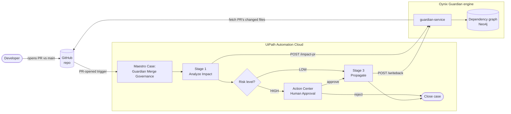
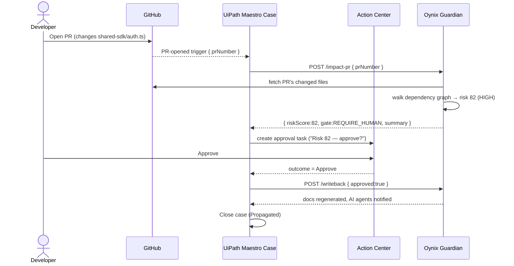
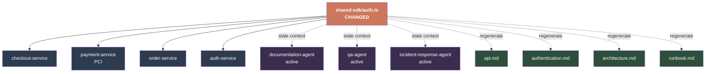

# Oynix Guardian — Architecture & How It Works

## 1. System architecture



**Flow in words:** a developer opens a PR against `main` → GitHub fires a
trigger → UiPath Maestro Case starts → **Analyze Impact** asks Guardian to score
the PR → if **HIGH**, the case pauses for a human in **Action Center**; if
**LOW**, it auto-approves → on approval, **Propagate** writes back. UiPath is the
orchestration + governance layer; Guardian is the brain.

---

## 2. Sequence — what happens on a PR



---

## 3. Why the score is 82 — the blast radius

Guardian walks the **real import graph**. Changing `shared-sdk/auth.ts` ripples
outward:



```
risk = (4 services × 10) + (3 active agents × 7) + (4 docs × 2)
       + 8 (payment / PCI) + 5 (shared auth contract)
     = 40 + 21 + 8 + 8 + 5
     = 82  → HIGH (≥ 60) → human approval required
```

A PR touching a leaf (e.g. `notification-service`) has no dependents →
**risk 10 → LOW → auto-propagate.** Same-size change, opposite decision —
because risk is about *what depends on the change*, not the change itself.

---

## 4. Components

| Layer | Piece |
|-------|-------|
| Trigger | GitHub PR-opened event |
| Orchestration | UiPath **Maestro Case** (Analyze → Approve → Propagate) |
| Integration | UiPath **API Workflows** + unified **HTTP connector** |
| Human-in-the-loop | UiPath **Action Center** (Simple Approval app) |
| Brain | **Oynix Guardian** — dependency graph + risk scoring (Node/Express + Neo4j) |
| Platform | UiPath **Automation Cloud** |
| Built with | **Claude Code** via UiPath for Coding Agents |
